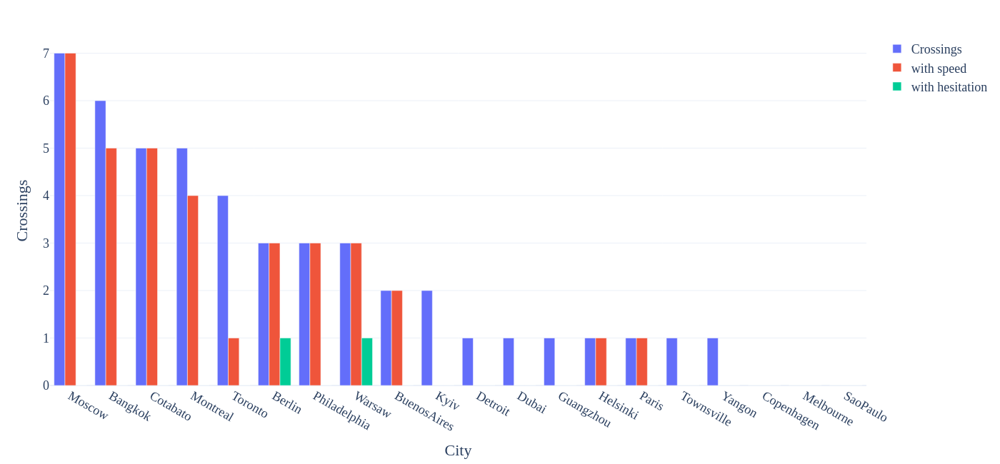
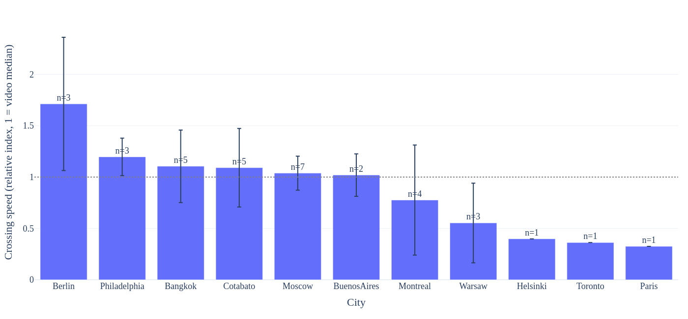
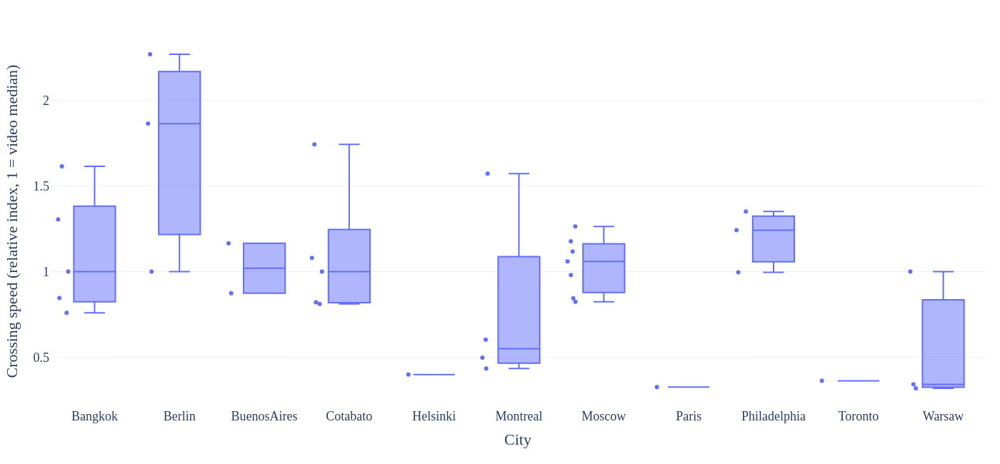
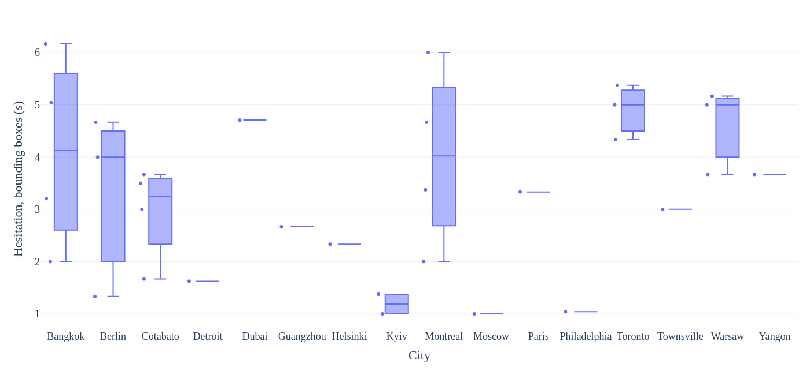
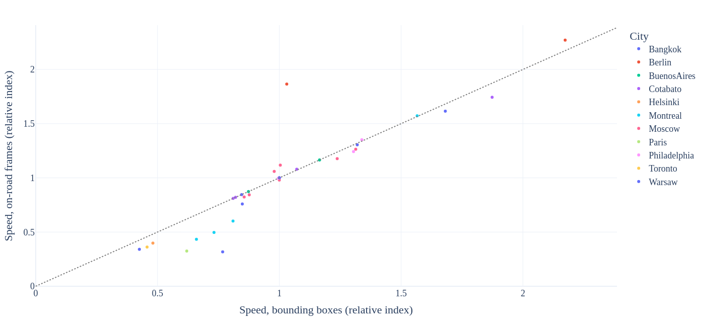
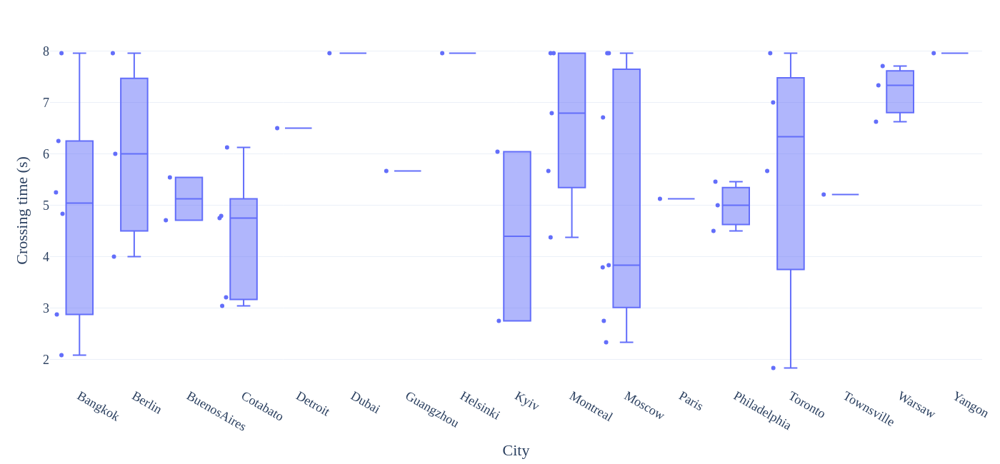

# Pedestrian crossing speed and hesitation time from dashcam videos

Detects and tracks road users in dashcam videos with YOLOv11x and BoT-SORT, then
measures, for every pedestrian who crosses the road in front of the car:

- **crossing speed**: crowd-city's relative motion index (see below)
- **hesitation time** (s): how long the pedestrian stood still before stepping onto the road
- **crossing time** (s): how long the crossing was observed

Tracking follows [crowd-dataset/crowd](https://github.com/crowd-dataset/crowd). The analysis is
the crowd-city code itself ([crowd-dataset/crowd-city](https://github.com/crowd-dataset/crowd-city)):
`crowd_city/` holds an unchanged copy of its crossing detection, metrics and road-surface
segmentation modules (commit in `crowd_city/SOURCE_COMMIT`), and `analysis.py` calls them in the
same order as crowd-city's own `analysis.py`.

## Data layout

```
data/
├── Amsterdam/
│   ├── drive_01.mp4
│   └── drive_02.mp4
└── Delhi/
    └── morning.mov
```

Every sub-folder of `data/` is a city, and every video in it (sub-folders included) is analysed.

## Setup

```bash
uv sync
cp default.config config
```

`config` must contain every key of `default.config` (the run stops otherwise). `default.secret` → `secret` is only needed for email notifications. Segmentation needs `ffmpeg`/`ffprobe` on the PATH; the SegFormer model is downloaded from Hugging Face on first use.

## Running

1. **Tracking** writes one CSV per video to `_output/bbox/<city>/<video>_<fps>.csv`, a `<video>_<fps>.json` next to it with the tracking settings used, and `_output/videos.csv` (city, fps, size and duration of every video). As in crowd, YOLO runs at confidence 0.0 so the tracker sees every box; `min_confidence` is applied when the analysis reads the CSV. Videos that already have a CSV are skipped unless `always_analyse` is true, and an interrupted video is redone on the next run. If the tracking settings differ from those stored with a CSV, the run warns but keeps the CSV: delete it (or set `always_analyse`) to track it again.

   ```bash
   uv run python main.py
   ```

   The first run downloads `yolo11x.pt` through ultralytics. The device is picked automatically (CUDA, Apple MPS, then CPU).

2. **Analysis** writes `_output/crossings.parquet` and `_output/crossings.csv` (one row per crossing), `_output/city_summary.csv` (one row per city) and plotly figures in `_output/figures/`.

   ```bash
   uv run python analysis.py
   ```

   Add `--force` to ignore the cache and analyse every video again.

### What is rerun

| Change | Rerun |
|---|---|
| New video in `data/` | Tracking and analysis of that video only |
| Nothing | Nothing (cached results are combined again) |
| A tracking CSV or video is rewritten | Analysis of that video |
| Code in `crowd_city/` or `analysis.py`, or a setting that changes results (`min_confidence`, road strip, `check_per_sec_time`, `crossing_rule`, segmentation model and sampling) | Analysis of every video; SegFormer labels are reused from the store when the crossing tracks and segmentation settings are unchanged |
| Comments, docstrings or formatting in that code | Nothing |
| Speed or waiting-time limits, `segmentation_is_primary`, plots, summary | Nothing (always rebuilt from the cached values) |

Per-video results are cached in `_output/analysis/<city>/<video>_<fps>.json` with a key built from their inputs (see `utils/cache.py`), and crowd-city's surface-label store is kept in `_output/segmentation/`.

## Method

All of this is crowd-city's code; see its README for the details.

1. **Detections** below `min_confidence` (0.7) and boxes without a track id are dropped.
2. **Crossing candidates.** With `crossing_rule: "road_crossing"` (rule D, crowd-city's default), a pedestrian counts as crossing when SegFormer-B2 (Cityscapes) puts their feet on the road, the track moves across at least 14% of the image width while there, and the box size changes slowly (rejecting people walking along the road). With `"detector"`, CROWD's original detector is used instead: the track passes through the central strip `[boundary_left, boundary_right]` and survives its geometric, rider and camera-motion filters.
3. **Road entry and exit.** The road surface under each crossing pedestrian's feet is read at 1 Hz, then at 4 Hz around the changes, giving the frames where they step onto and off the road.
4. **Hesitation time** is the stationary time ending at road entry: checks `check_per_sec_time` times per second, still when the box centre moved at most 10% of the box height, at least three still checks in a row. It is missing when the pedestrian did not stand still, or was already on the road when first seen (`hesitation_unobservable`).
5. **Speed.** crowd-city converts box motion to m/s with a model calibrated on Waymo; that model is not used here, and crowd-city then reports its **relative motion index** instead: a pedestrian's camera-motion-compensated speed divided by the median of the comparable pedestrians in the same video (1.0 = typical for that video). It needs at least three comparable tracks in the video (`too_few_comparable_tracks` otherwise). The road-surface speed uses only the frames on the road.

Both derivations are kept in `crossings.csv`: `*_bbox_*` from the whole bounding-box track and `*_seg_*` from the road surface. `speed_index` and `hesitation_s` hold the reported one, chosen by `segmentation_is_primary` (true, as in crowd-city's configuration).

### Limitations

- The speed index is relative within a video, so it compares pedestrians in the same video, not cities: with one video per city each city is centred near 1.0 by construction.
- Short clips rarely show the wait: a pedestrian already on the road in the first frame has no observable hesitation time.
- `crowd_city/core/` replaces crowd-city's YouTube `mapping.csv` lookups, which these videos are not in. The video fps comes from the detection file name, and stature correction stays off (crowd-city's default).

## Results

Run on the 20 clips in `data/` (one 8 s, 1920×1080, 24 fps dashcam clip per city) with crowd-city `26785f6`, the road-crossing rule and road-surface values reported (the settings in `default.config`). SegFormer selected **47 crossings** in 17 cities out of 72 candidates; 35 have a speed index and 2 a hesitation time before road entry. The bounding-box hesitation time is shown alongside because the road-surface one is rarely observable in such short clips.

| City | Crossings | Speed index (n) | Hesitation before road entry, s (n) | Hesitation, boxes, s (n) |
|---|---|---|---|---|
| Moscow | 7 | 1.04 (7) | – (0) | 1.0 (1) |
| Bangkok | 6 | 1.10 (5) | – (0) | 4.1 (4) |
| Cotabato | 5 | 1.09 (5) | – (0) | 3.0 (4) |
| Montreal | 5 | 0.78 (4) | – (0) | 4.0 (4) |
| Toronto | 4 | 0.36 (1) | – (0) | 4.9 (3) |
| Berlin | 3 | 1.71 (3) | 1.3 (1) | 3.3 (3) |
| Philadelphia | 3 | 1.20 (3) | – (0) | 1.0 (1) |
| Warsaw | 3 | 0.55 (3) | 2.0 (1) | 4.6 (3) |
| BuenosAires | 2 | 1.02 (2) | – (0) | – (0) |
| Kyiv | 2 | – (0) | – (0) | 1.2 (2) |
| Detroit | 1 | – (0) | – (0) | 1.6 (1) |
| Dubai | 1 | – (0) | – (0) | 4.7 (1) |
| Guangzhou | 1 | – (0) | – (0) | 2.7 (1) |
| Helsinki | 1 | 0.40 (1) | – (0) | 2.3 (1) |
| Paris | 1 | 0.32 (1) | – (0) | 3.3 (1) |
| Townsville | 1 | – (0) | – (0) | 3.0 (1) |
| Yangon | 1 | – (0) | – (0) | 3.7 (1) |
| Copenhagen | 0 | – (0) | – (0) | – (0) |
| Melbourne | 0 | – (0) | – (0) | – (0) |
| SaoPaulo | 0 | – (0) | – (0) | – (0) |

How to read these numbers:

- **Speed index** compares a pedestrian with the others in the same clip, so with one clip per city each city is centred near 1.0 by construction; it does not rank cities. A speed index needs at least three comparable pedestrians in the clip, which is why 12 crossings have none.
- **Hesitation before road entry** is missing for 45 of the 47 crossings because the pedestrian was already on the road when first seen: 38 crossings start in the first half-second of the clip.
- **Hesitation from the boxes** is crowd-city's bounding-box initiation time: the first still period anywhere in the track, which can include standing in the road.

### Figures

Click a figure to open its interactive version. The interactive figures are displayed using `htmlpreview.github.io`, which may be blocked on some networks; the `.html` files are also in `readme/` and can be opened locally. `analysis.py` writes every figure to `_output/figures/`.

**Crossings per city**, and how many of them got a speed index and a hesitation time:

[](https://htmlpreview.github.io/?https://github.com/Shaadalam9/vlm_crossing/blob/main/readme/crossings_city.html)

**Mean speed index per city** (error bars: one standard deviation; dotted line: the video median, 1.0):

[](https://htmlpreview.github.io/?https://github.com/Shaadalam9/vlm_crossing/blob/main/readme/speed_crossing_city.html)

**Speed index of every crossing:**

[](https://htmlpreview.github.io/?https://github.com/Shaadalam9/vlm_crossing/blob/main/readme/box_speed_index.html)

**Bounding-box hesitation time of every crossing:**

[](https://htmlpreview.github.io/?https://github.com/Shaadalam9/vlm_crossing/blob/main/readme/box_hesitation_bbox_s.html)

**Speed from the whole track against the on-road frames only**, one point per crossing (dotted line: equal values). Most crossings agree; the road-restricted speed is lower for some slow crossings.

[](https://htmlpreview.github.io/?https://github.com/Shaadalam9/vlm_crossing/blob/main/readme/scatter_speed_bbox-segmentation.html)

**Observed crossing time:** capped at the 8 s clip length, since many pedestrians are visible for the whole clip.

[](https://htmlpreview.github.io/?https://github.com/Shaadalam9/vlm_crossing/blob/main/readme/box_crossing_time_s.html)

The figures in `readme/` are refreshed from the latest results with `uv run python readme_figures.py`.

## Configuration

| Key | Meaning |
|---|---|
| `data`, `output` | Input and output folders, relative to the repository or absolute |
| `cities_analyse` | Only these city folders; empty means all |
| `tracking_model`, `bbox_tracker`, `track_buffer_sec` | YOLO weights, BoT-SORT YAML, seconds a lost track is kept |
| `yolo_imgsz`, `device`, `half_precision` | Tracking settings |
| `save_annotated_video`, `display_frame_tracking` | Write `_output/annotated/<city>/<video>.mp4` / show frames live |
| `min_confidence` | Detections below this are ignored by the analysis |
| `boundary_left`, `boundary_right` | Road strip of the `detector` rule, in normalised image x |
| `check_per_sec_time` | Hesitation checks per second |
| `crossing_rule` | `road_crossing` (rule D, needs segmentation) or `detector` |
| `use_segmentation`, `segmentation_is_primary` | Run the road-surface pass; report its values |
| `segmentation_model`, `segmentation_device`, `segmentation_input_width/height`, `segmentation_min_confidence` | SegFormer settings |
| `segmentation_coarse_hz`, `segmentation_refine_hz` | Sampling rates for finding road entry and exit |
| `segmentation_batch_size`, `segmentation_parallel_videos` | GPU batch and videos read at once (lower the batch if the GPU runs out of memory) |
| `seg_data` | Folder of crowd-city's surface-label store |
| `processing_fps`, `ftp_base_url` | crowd-city settings for its YouTube footage; `null` and empty here |
| `min/max_speed_limit`, `min/max_waiting_time` | Values outside these ranges are dropped (crowd-city's 0.3–3.5 for speed) |
| `cpu_worker` | Processes used for crossing detection |
| `save_images` | Also export PNG/EPS figures (needs kaleido) |
| `open_figures` | Open every HTML figure in the default browser when it is written |

Update the copy of crowd-city with `python sync_crowd_city.py /path/to/crowd-city`.
